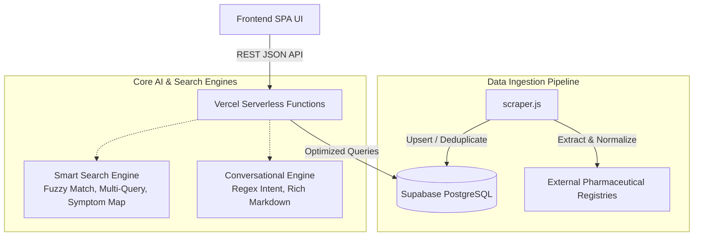

<div align="center">

# 💊 PharmaLens
**The Ultimate Bangladesh Drug Intelligence & AI Platform**

[](https://vercel.com)
[](https://supabase.com)
[](https://opensource.org/licenses/MIT)

*A highly-optimized, serverless drug intelligence platform that maps generic medications to brand names available in Bangladesh. Powered by an intelligent search engine, an AI conversational chatbot, and a robust PostgreSQL data ingestion pipeline.*

<br>
</div>

---

## 📖 Table of Contents
- [✨ Core Features](#-core-features)
- [📐 System Architecture](#-system-architecture)
- [🛠️ Technology Stack](#️-technology-stack)
- [📁 Folder Structure](#-folder-structure)
- [🚀 Quick Start (Local Setup)](#-quick-start-local-setup)
- [☁️ Deployment (Vercel & Supabase)](#️-deployment-vercel--supabase)
- [📡 API Reference](#-api-reference)
- [⚠️ Disclaimer](#️-disclaimer)

---

## ✨ Core Features

### 🔍 **Next-Generation Smart Search**
- **Multi-Query Support:** Search for multiple symptoms simultaneously (e.g., *"fever and cough medicine"*).
- **Intelligent Typo Correction:** Implements Levenshtein distance algorithms to provide *"Did you mean?"* fuzzy match suggestions.
- **Categorical & Symptom Mapping:** Automatically maps common symptoms to their respective therapeutic categories.

### 🤖 **Conversational AI Chatbot**
- **Natural Language Intent Detection:** Understands complex queries like *"What are the brands of Paracetamol?"* or *"Tell me about Napa."*
- **Rich Markdown Cards:** Returns highly structured, aesthetically pleasing Markdown cards featuring indications, precautions, contraindications, and top brands.
- **Contextual Fallbacks:** Gracefully handles unknown queries and guides users toward supported formats.

### 🔄 **Robust Data Ingestion Pipeline**
- **Automated Scraping:** Built-in web scraper using `axios` and `cheerio` to fetch generic and brand data dynamically.
- **Intelligent Deduplication:** Utilizes `ON CONFLICT` constraints to gracefully upsert and prevent data duplication.
- **Relational Integrity:** Maps complex many-to-one relationships between generics and brands natively in PostgreSQL.

### ⚡ **Enterprise-Grade Performance**
- **In-Memory Caching:** Front-end caches frequent API responses to eliminate redundant network round-trips.
- **Debounced Inputs:** Search inputs are heavily optimized to prevent rate-limiting and reduce server load.
- **Serverless Architecture:** Fully optimized for edge/serverless environments like Vercel.

---

## 📐 System Architecture

The application follows a decoupled, serverless architecture optimized for high availability and zero maintenance.



---

## 🛠️ Technology Stack

| Layer | Technology | Description |
|-------|------------|-------------|
| **Frontend** | Vanilla JS, HTML5, CSS3 | Pure, lightweight SPA with custom Glassmorphism UI and Markdown parser. |
| **Backend API** | Node.js (Serverless) | Fast, stateless API endpoints deployed as Vercel Functions. |
| **Database** | PostgreSQL (Supabase) | Relational mapping of Drugs, Brands, Aliases, and Search Logs. |
| **Data Pipeline** | Axios, Cheerio, PG | Robust web scraping and direct-to-database ingestion mechanics. |

---

## 📁 Folder Structure

```text
PharmaLens/
├── api/                    # Vercel Serverless API endpoints
│   ├── analytics.js        # Search analytics & trending data
│   ├── brand.js            # Brand lookup handlers
│   ├── categories.js       # Category distribution data
│   ├── chat.js             # Conversational AI gateway
│   ├── drug.js             # Generic drug lookup
│   └── search.js           # Smart search & typo-correction endpoint
├── lib/                    # Core Business Logic
│   ├── chatEngine.js       # NLP intent parsing and response formatting
│   ├── data.js             # Seed/Fallback database mock
│   ├── db.js               # Supabase connection pool and query handlers
│   └── searchEngine.js     # Multi-query parsing, Levenshtein distances
├── public/                 # Static Frontend Assets
│   ├── css/styles.css      # Glassmorphism & responsive styling
│   ├── js/app.js           # SPA routing, caching, and DOM manipulation
│   └── index.html          # Main application entry point
├── scripts/                # Utility & Data Pipelines
│   ├── migrate.js          # PostgreSQL schema initialization
│   ├── scraper.js          # Advanced data ingestion & scraping
│   └── seed.js             # Legacy static seeder
├── server.js               # Local development server (mimics Vercel)
└── vercel.json             # Edge routing and CORS configuration
```

---

## 🚀 Quick Start (Local Setup)

Follow these steps to run the PharmaLens platform locally.

### 1. Clone & Install
```bash
git clone https://github.com/KobiTalha/PharmaLens.git
cd PharmaLens
npm install
```

### 2. Environment Configuration
Copy the template file and insert your Supabase connection string.
```bash
cp .env.example .env
```
Inside `.env`, ensure your connection string is formatted properly:
```env
DATABASE_URL=postgresql://postgres:[PASSWORD]@[SUPABASE_URL]:5432/postgres
```

### 3. Database Migration & Data Ingestion
Initialize your PostgreSQL schema and run the scraper to populate the database with real-world data.
```bash
# Initialize Tables (drugs, brands, search_logs)
npm run migrate

# Populate the database (fetches top generics)
npm run scrape
```

### 4. Start Development Server
```bash
npm run dev
```
Visit `http://localhost:3000` to interact with the platform.

---

## ☁️ Deployment (Vercel & Supabase)

PharmaLens is natively designed for serverless environments.

1. **Supabase (Database)**
   - Create a project on [Supabase](https://supabase.com).
   - Retrieve your `DATABASE_URL` from the database settings.
   - Run `npm run migrate` locally using that URL to prepare the schema.

2. **Vercel (Hosting)**
   - Connect your GitHub repository to [Vercel](https://vercel.com).
   - In the project settings, add `DATABASE_URL` as an Environment Variable.
   - Vercel will automatically deploy the `public/` directory statically and route `/api/*` to the serverless functions.

---

## 📡 API Reference

All endpoints return JSON responses.

### `GET /api/search?query={term}`
Executes the smart search engine.
- **Returns:** Drug arrays, query type (`direct`, `category`, `fuzzy`, `multi-query`), and typo suggestions.

### `POST /api/chat`
Processes conversational queries.
- **Body:** `{ "message": "Your text here" }`
- **Returns:** Rich Markdown formatted string and associated drug metadata.

### `GET /api/drug?id={id}`
Retrieves deep information on a specific generic drug, including all manufactured brands, warnings, and contraindications.

### `GET /api/analytics`
Fetches high-level metrics including the most frequently searched queries, trending categories, and total platform usage.

---

## ⚠️ Disclaimer

**This platform is developed strictly for educational and informational purposes.** 
- PharmaLens does **not** provide medical advice, diagnosis, or treatment. 
- Always consult with a qualified healthcare provider or licensed physician before making any medical decisions or taking any medication.
- No brand is ranked, endorsed, or recommended over another. Data is algorithmically aggregated from public registries.

---
<div align="center">
  <i>Engineered for the future of pharmaceutical data accessibility.</i>
</div>
